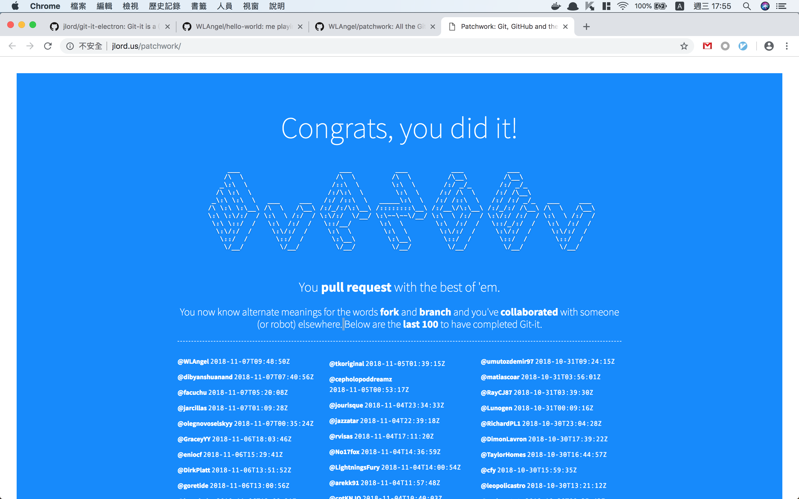

# [Git-it](https://github.com/jlord/git-it-electron)
作者: [jlord](https://github.com/jlord)

這是一個簡單教你使用 git 及 github 的應用程式，內容包含安裝 git、建 repository、添加 commit、添加遠端 repo、clone repo、建立分支、拉取遠端資料、合併分支、刪除分支等，還有一些 github 功能的應用，例如 fork、collaborator、pull request 等；*支援多國語言*。

個人覺得內容很棒，適合新手入門 git，走完一輪對於 git 的基礎操作會有一定的認識，裡頭寫到的所有名詞及觀念解釋都建議仔細讀過。不過要注意的是這個教學裡教的東西真的只有入門，還有很多 git 指令沒提到，想學 git 的人只玩這個是不夠的。

因為過程會操作自己的 github，照著程式的步驟走完一輪對自己的 github 影響(?)...
- 在你的 github 建一個 repository ([像這樣...](https://github.com/WLAngel/hello-world))
- fork 一個作者所寫的 [repo](https://github.com/jlord/patchwork) 到你自己的 github 中 ([像這樣...](https://github.com/WLAngel/patchwork))
- 向作者的 repo 發 pull reuqest 並且合併，最終可以到這個 repo 的 [github page](http://jlord.us/patchwork/) 看到自己的名字被記錄在上面 (?) 

